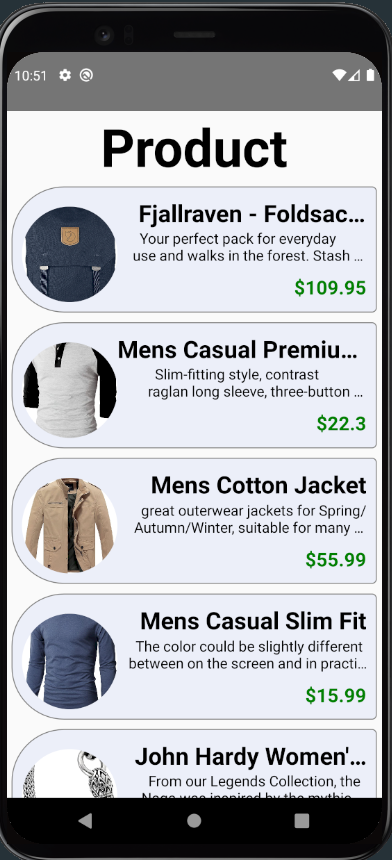

# İstanbul React-Native Bootcamp Hafta1 Ödev

Bu projede gelen ürünleri listeleyen bir uygulama yaptım.

  

### Proje Nasıl Çalıştırılır

- Projeyi fork'ladıktan ya da indirdikten sonra projenin bulunduğu klasörde "npm install" komutu ile gerekli paketlerin yüklenmesi gerekiyor.
- Daha sonra "npm run start" komutu ile uygulama başlatılabilir.

### Proje Hakkında

FlatList componetini kullanarak kendi custom componetimi ekranda rest api'dan gelen bilgiler çercevesinde listeledim. StyleSheet kullanarak da still ayarlamalarını yaptım.

